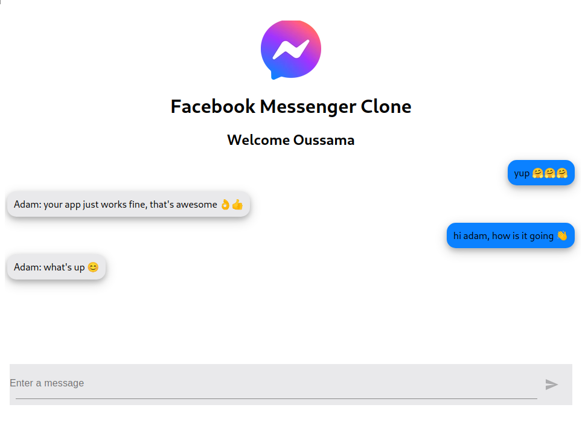

# Description
This is a simple clone application for the popular facebook messenger chat app.

### Used technologies
  -  React.js
  -  Firebase for realtime database and hosting.
  -  Material-UI
  -  FlipMove library for animation

### It should look like this: 

